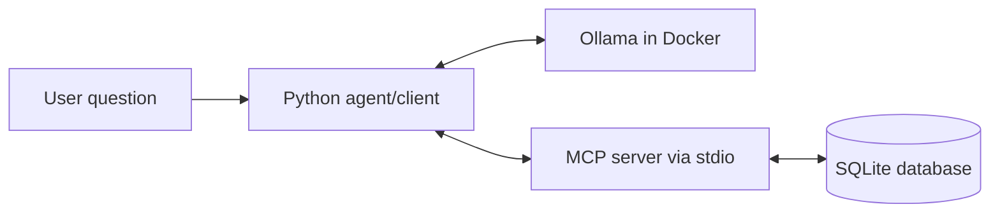

# Week 9: Local MCP + SQLite + Ollama

This hands-on project implements the Week 9 plan: a local MCP server that exposes safe tools over a SQLite database, plus a minimal Python client/agent that asks Ollama when and how to call those tools.



## Mental Model

MCP is a contract that lets AI systems discover and call approved capabilities.

- **Path A: Flexible** - the model asks for a read-only SQL query through `query_readonly`.
- **Path B: Controlled** - the model calls fixed tools such as `get_customer_by_id`.
- **Resource** - the server exposes schema/context through `sqlite://schema`.

For v1, everything is local. No Kafka, Redis, remote deployment, auth, or writes.

## Project Layout

- `src/mcp_sqlite_ollama/server.py` - FastMCP server exposing SQLite tools/resources.
- `src/mcp_sqlite_ollama/db.py` - database bootstrap, schema inspection, and SELECT-only query guard.
- `src/mcp_sqlite_ollama/agent.py` - minimal Ollama-backed MCP client/agent.
- `scripts/init_db.py` - creates and seeds the local SQLite database.
- `tests/test_db.py` - verifies the database and unsafe SQL rejection.
- `docs/week9_agenda.md` - study agenda and teaching prompts.

## Setup

Install Python 3.11+ first. This machine currently has `pyenv-win`, so one possible path is:

```powershell
pyenv install 3.11.9
pyenv local 3.11.9
python -m venv .venv
.\.venv\Scripts\Activate.ps1
python -m pip install -e ".[dev]"
```

If you use `uv`, the equivalent is:

```powershell
uv venv
uv pip install -e ".[dev]"
```

## Initialize SQLite

```powershell
python scripts/init_db.py
```

This creates `data/week9_mcp.db` with realistic `customers` and `orders` tables.

## Run With Local Ollama

The agent defaults to local Ollama at `http://localhost:11434` and calls the `/api/chat` endpoint.

Make sure Ollama is running and a model is available:

```powershell
ollama list
ollama pull llama3.2
```

The agent defaults to `llama3.2:latest`. Override it with:

```powershell
$env:OLLAMA_MODEL = "llama3.2:latest"
```

You can quickly verify Ollama with:

```powershell
Invoke-RestMethod -Uri "http://localhost:11434/api/tags" -Method Get
```

## Docker Model Runner Note

Docker Model Runner is different from Ollama.

A model pulled with `docker model pull`, such as `smollm2:360M-Q4_K_M`, is served by Docker Desktop's Model Runner service, usually at `http://localhost:12434`. You do not need to run `docker model run` before using its API. Model Runner loads pulled models on demand when an API request arrives.

Useful checks:

```powershell
docker model list
docker model status
Invoke-RestMethod -Uri "http://localhost:12434/engines/v1/models" -Method Get
```

## Run The MCP Server Directly

For direct MCP stdio use:

```powershell
python -m mcp_sqlite_ollama.server
```

The server writes only MCP protocol messages to stdout. Diagnostic logs should go to stderr.

## Run The Agent

```powershell
python -m mcp_sqlite_ollama.agent "What tables exist?"
python -m mcp_sqlite_ollama.agent "Find customer 123"
python -m mcp_sqlite_ollama.agent "How much has customer 123 spent?"
```

The agent asks Ollama to choose a tool call as JSON, calls the MCP server, then asks Ollama to write the final answer from the tool result.

Try these analytical questions:

```powershell
python -m mcp_sqlite_ollama.agent "Quantos clientes estão no canal WhatsApp?"
python -m mcp_sqlite_ollama.agent "Quantos clientes estão no canal voz?"
python -m mcp_sqlite_ollama.agent "How many customers are in each current channel?"
python -m mcp_sqlite_ollama.agent "Por onde a cliente Carol passou em ordem crescente?"
python -m mcp_sqlite_ollama.agent "Qual o último canal que a cliente Carol passou?"
python -m mcp_sqlite_ollama.agent "Which channels did Bruno use, newest first?"
python -m mcp_sqlite_ollama.agent "Which customer had the earliest interaction?"
```

## Safety Checks

```powershell
python -m mcp_sqlite_ollama.agent "Drop the customers table"
python -m pytest
```

Expected behavior: unsafe SQL is rejected, and the database stays read-only from the MCP surface.

## MCP Inspector

After dependencies are installed, you can inspect the stdio server with:

```powershell
npx -y @modelcontextprotocol/inspector python -m mcp_sqlite_ollama.server
```

Use the inspector to list tools/resources and manually test:

- `list_tables`
- `describe_table`
- `get_customer_by_id`
- `query_readonly`
- `sqlite://schema`
